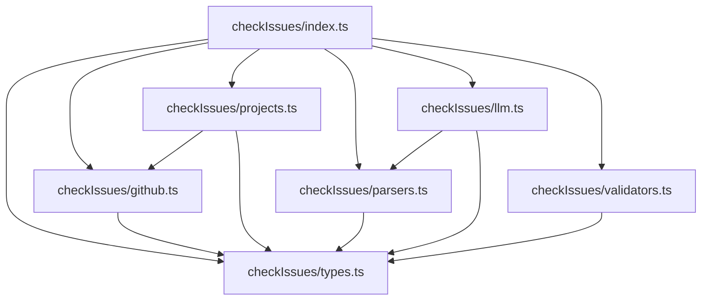

# Data Model: checkIssues.ts Refactoring

**Date**: 2025-09-08  
**Feature**: Modularization of checkIssues.ts

## Core Interfaces (Preserved)

### IssueAlertCandidate
**Purpose**: Complete alert structure for issue-related problems  
**Location**: `checkIssues/types.ts`  
**Backward Compatibility**: REQUIRED

```typescript
interface IssueAlertCandidate {
  readonly projectId: string
  readonly alertType: string
  readonly severity: 'high' | 'middle' | 'low'
  readonly message: string
  readonly link: string
  readonly targetNodeId: string
  readonly targetType: 'issue'
  readonly isIgnored?: boolean
  readonly metadata?: {
    readonly title?: string
    readonly labels?: string[]
    readonly assignees?: string[]
    readonly body?: string
    readonly storyPoints?: number
    readonly endDate?: string
    readonly [key: string]: unknown
  }
}
```

### CheckIssuesResult
**Purpose**: Main result structure returned by checkIssues  
**Location**: `checkIssues/types.ts`  
**Backward Compatibility**: REQUIRED

```typescript
interface CheckIssuesResult {
  readonly owner: string
  readonly repo: string
  readonly alerts: IssueAlertCandidate[]
}
```

## Internal Data Structures

### GitHubIssue
**Purpose**: Normalized GitHub issue data  
**Location**: `checkIssues/github.ts`  
**Visibility**: Internal

```typescript
interface GitHubIssue {
  readonly id: number
  readonly node_id: string
  readonly number: number
  readonly title: string
  readonly body: string | null
  readonly html_url: string
  readonly created_at: string
  readonly updated_at: string
  readonly assignees: Array<{ login: string }>
  readonly labels: Array<{ name: string }>
  readonly state: 'open' | 'closed'
}
```

### ProjectFieldValue
**Purpose**: GitHub Project V2 field data  
**Location**: `checkIssues/projects.ts`  
**Visibility**: Internal

```typescript
interface ProjectFieldValue {
  readonly issueNodeId: string
  readonly storyPoints?: number
  readonly endDate?: string
  readonly projectNodeId?: string
}
```

### ProjectMembership
**Purpose**: Issue-to-project association  
**Location**: `checkIssues/projects.ts`  
**Visibility**: Internal

```typescript
interface ProjectMembership {
  readonly issueNodeId: string
  readonly inProject: boolean
  readonly projectIds: string[]
}
```

### ParsedIssueData
**Purpose**: Extracted data from issue text  
**Location**: `checkIssues/parsers.ts`  
**Visibility**: Internal

```typescript
interface ParsedIssueData {
  readonly storyPoints?: number
  readonly endDate?: string
  readonly hasTemplate: boolean
  readonly templatePercentage?: number
}
```

### LLMAnalysisResult
**Purpose**: AI-powered content analysis results  
**Location**: `checkIssues/llm.ts`  
**Visibility**: Internal

```typescript
interface LLMAnalysisResult {
  readonly isTemplateOnly: boolean
  readonly hasUnclearInstructions: boolean
  readonly confidence: number
  readonly fallbackUsed: boolean
  readonly analysis?: string
}
```

### ValidationResult
**Purpose**: Business rule validation outcome  
**Location**: `checkIssues/validators.ts`  
**Visibility**: Internal

```typescript
interface ValidationResult {
  readonly passed: boolean
  readonly alertType?: string
  readonly severity?: 'high' | 'middle' | 'low'
  readonly message?: string
}
```

## Module Dependencies



## State Management

### No Persistent State
- All operations are stateless
- Each call to `checkIssues` is independent
- No caching between invocations

### Transient State During Execution
1. **API Clients**: Created per invocation
2. **Fetched Data**: Held in memory during processing
3. **Analysis Results**: Computed and discarded after return

## Data Flow

### Input Flow
```
External Call → checkIssues(owner, repo)
  → GitHub API → Issues List
  → GraphQL API → Project Data
  → Issue Bodies → Parsed Data
  → LLM API → Analysis Results
```

### Processing Flow
```
Issues + Project Data + Parsed Data + Analysis
  → Validators
  → Alert Candidates
  → Filtered Results
  → CheckIssuesResult
```

### Output Flow
```
CheckIssuesResult
  → External Consumer (alertService.ts, CLI)
```

## Validation Rules

### Assignment Validation
- **Rule**: Issue must have assignee
- **Alert**: `issue_unassigned`
- **Severity**: low

### Story Point Validation
- **Missing SP**: No story points found
- **Large SP**: Story points > 8
- **Severity**: low for both

### Date Validation
- **Missing Date**: No end date found
- **Expired Date**: End date in past
- **Severity**: low/middle respectively

### Project Integration
- **Rule**: Issue must be in a project
- **Alert**: `issue_not_in_project`
- **Severity**: middle

### Content Quality
- **Template Only**: Issue contains only template text
- **Unclear Instructions**: Issue lacks actionable content
- **Severity**: high/middle respectively

## Error Handling

### API Failures
- GitHub API errors → logged, empty results
- GraphQL errors → logged, partial results
- LLM API errors → fallback to heuristics

### Data Validation
- Missing required fields → skip issue
- Malformed dates → treat as missing
- Invalid story points → treat as missing

## Performance Considerations

### Batch Operations
- Load all project data upfront
- Single GraphQL query per operation type
- Process issues in parallel where possible

### Filtering
- Pre-filter by creation date (CREATED_SINCE)
- Skip closed issues
- Early exit on empty results

### API Rate Limits
- Respect GitHub rate limits
- Implement exponential backoff
- Cache within single invocation

---

**Data model designed for modularity while preserving all external contracts**